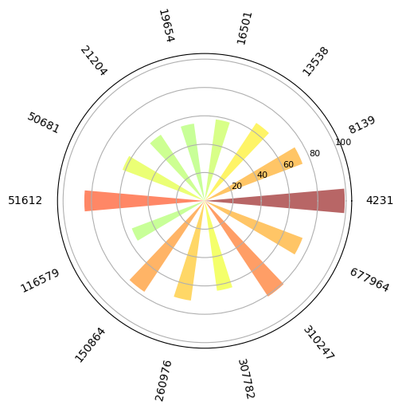

## Introduction
Please download the Building [Violation dataset(csv)](https://data.cityofchicago.org/Buildings/Building-Violations/22u3-xenr) to your local first

## Screenshots

## Data Source 
- [Building Violation](https://data.cityofchicago.org/Buildings/Building-Violations/22u3-xenr)
- [Crimes in 2023](https://data.cityofchicago.org/Public-Safety/Crimes-2023/xguy-4ndq)
- [Chicago Personal Income from 1970-2021](https://fred.stlouisfed.org/series/CHIC917PCPI)
- [Chicago Bundaries](https://fmiranda.me/courses/cs424-fall-2023/lab-1/boundaries-zipcode.geojson)
